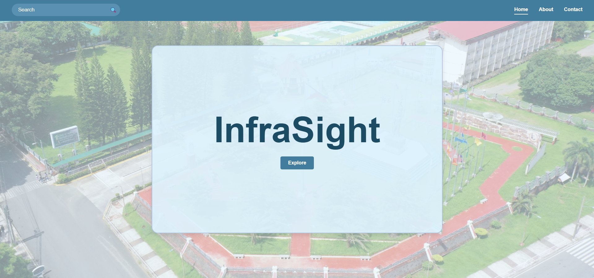
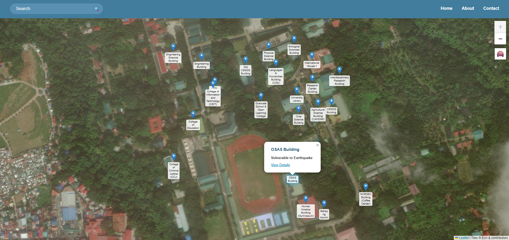
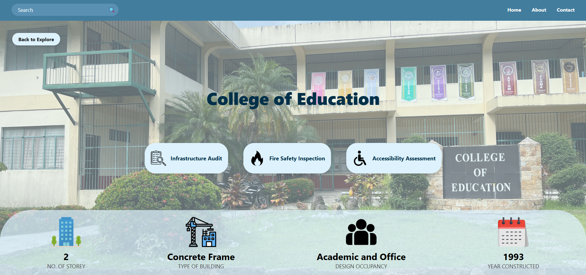
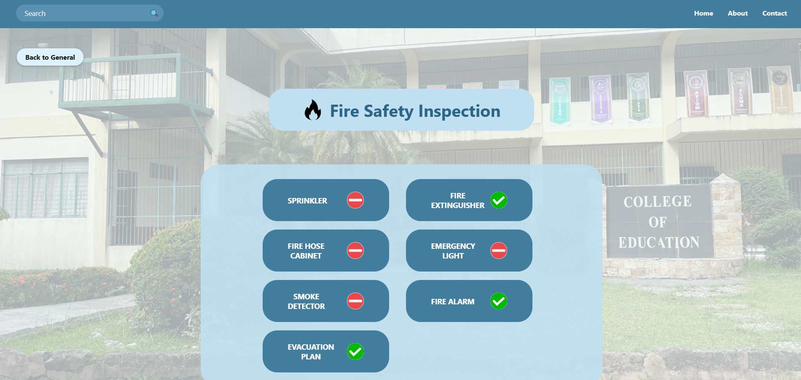
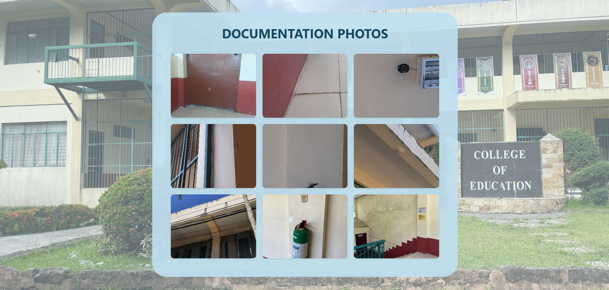

# 🏫 Infrasight

Infrasight is a commissioned web project for indexing and showcasing campus buildings at Cavite State University (CvSU). Each building entry includes detailed inspection data, covering:  

🏗️ Infrastructure Audit  
🔥 Fire Safety Inspection  
♿ Accessibility Evaluation   

   
   
   
   
  

All buildings are searchable via a dynamic search bar that works across all pages.  

### 🗺️ Now with Interactive Map Support!
An interactive campus map allows users to visually locate and explore buildings with clickable markers for quick access to inspection details.  

📁 Built using HTML, CSS, and JavaScript.  

Live at: https://jveztraaaa.github.io/infrasight/
  

🗓️ Completed: June 2025
