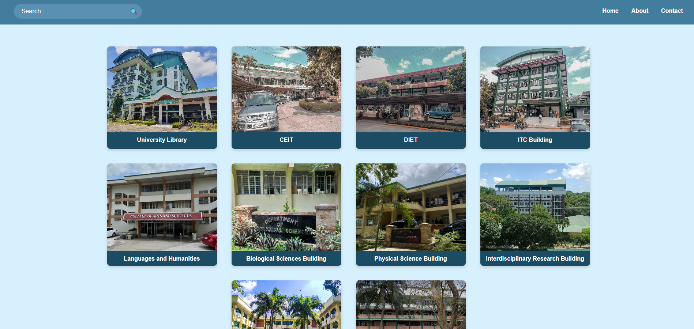

# CavSU Building Audit & Safety Index

A commissioned web project for indexing campus buildings at Cavite State University (CavSU). This site displays detailed inspection data per building, covering:  

🏗️ Infrastructure Audit  
🔥 Fire Safety Inspection   

   
   
   
   
   

All buildings are searchable via a dynamic search bar that works across all pages.  
📠Built using HTML, CSS, and JavaScript.  

Live at: https://jveztraaaa.github.io/infrasight/
  

🗓️ Completed: May 2025
